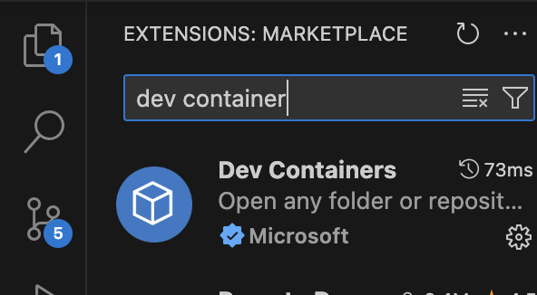
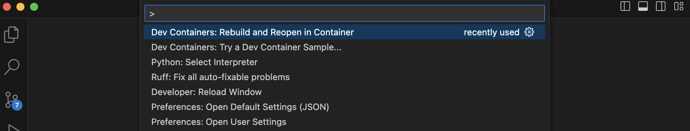

# Evolution-of-Plan

Let LLM evolves its plan until it works

## Setup Local Development for vscode users:

### Official documentation by vscode maintainers: [vscode](https://code.visualstudio.com/docs/devcontainers/containers)

### Requirements:
- docker installed
- dev container plugin installed

in vscode hit `ctrl + shift + p` and select `Dev Containers: Rebuild and Reopen in Container.`

### Visual help for plugins and creating dev environment:

### Locating plugin:

### Build dev environment:

